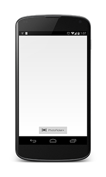
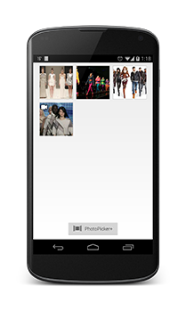

Introduction
====

PhotoPickerPlusTutorial is a tutorial project that shows how to use the PhotoPicker+ component. It contains Chute SDK library as well as PhotoPicker+ library. This tutorial enables browsing your locally-stored photos and/or videos as weel as your albums and media items from your social galleries, item selection and display.



Setup
====

* Add the PhotoPicker+ component to your project by either copying all the resources and source code or by adding it as an Android Library project.

* Go through [ProjectSetup.md](../ChutePhotoPicker+/ProjectSetup.md) and [PhotoPicker+ documentation](../ChutePhotoPicker+/README.md) for more info.

* Register the activities, services and the application class into AndroidManifest.xml file:

    ```
        <application
        android:name=".PhotoPickerPlusTutorialApp"
        android:allowBackup="true"
        android:configChanges="keyboardHidden|orientation|screenSize"
        android:icon="@drawable/ic_launcher"
        android:label="@string/app_name"
        android:theme="@style/PhotoPickerTheme" >
        <service android:name="com.dg.libs.rest.services.HTTPRequestExecutorService" />

        <activity
            android:name="com.chute.android.photopickerplustutorial.activity.PhotoPickerPlusTutorialActivity"
            android:label="@string/app_name" >
            <intent-filter>
                <action android:name="android.intent.action.MAIN" />

                <category android:name="android.intent.category.LAUNCHER" />
            </intent-filter>
        </activity>
        <activity android:name="com.chute.android.photopickerplus.ui.activity.ServicesActivity" >
        </activity>
        <activity android:name="com.chute.android.photopickerplus.ui.activity.AssetActivity" >
        </activity>
        <activity
            android:name="com.chute.sdk.v2.api.authentication.AuthenticationActivity"
             android:configChanges="orientation|screenSize" 
            android:theme="@android:style/Theme.Light.NoTitleBar" >
        </activity>
        </application>

    ```


Usage
====

##PhotoPickerPlusTutorialApp.java 
This class is the extended Application class. It is registered inside the ``<application>`` tag in the manifest and is used for initializing the utility classes used in the component.
PhotoPickerPlusTutorialApp can extend PhotoPickerPlusApp as shown in this tutorial:

<pre><code>
public class PhotoPickerPlusTutorialApp extends PhotoPickerPlusApp {

    @Override
	public void onCreate() {
		super.onCreate();
        ALog.setDebugTag("PhotoPicker");
		ALog.setDebugLevel(DebugLevel.ALL);

		/**
		 * Fill in using "app_id" and "app_secret" values from your Chute
		 * application.
		 * 
		 * See <a href="https://apps.getchute.com">https://apps.getchute.com</a>
		 */

		Chute.init(this, new AuthConstants(APP_ID, APP_SECRET));
		
		Map<AccountType, DisplayType> map = new HashMap<AccountType, DisplayType>();
		map.put(AccountType.INSTAGRAM, DisplayType.LIST);

		PhotoPickerConfiguration config = new PhotoPickerConfiguration.Builder(
				getApplicationContext())
				.isMultiPicker(true)
				.defaultAccountDisplayType(DisplayType.LIST)
		        .accountDisplayType(map)
				.accountList(AccountType.FLICKR, AccountType.DROPBOX,
						AccountType.INSTAGRAM, AccountType.GOOGLE,
						AccountType.YOUTUBE)
				.localMediaList(LocalServiceType.ALL_MEDIA,
						LocalServiceType.CAMERA_MEDIA,
						LocalServiceType.RECORD_VIDEO,
						LocalServiceType.LAST_VIDEO_CAPTURED)
				.configUrl(ConfigEndpointURLs.SERVICES_CONFIG_URL)
				.supportImages(true).supportVideos(true).build();
		PhotoPicker.getInstance().init(config);

	}

}
</code></pre>

This way you can use your own methods and code inside the Application class. 

If you decide to extend the Application class instead of PhotoPickerPlusApp you must copy the all the code below:

<pre><code>
public class PhotoPickerPlusTutorialApp extends Application {

    private static ImageLoader createImageLoader(Context context) {
    	ImageLoader imageLoader = new ImageLoader(context, R.drawable.placeholder);
		imageLoader.setDefaultImageSize((int) TypedValue.applyDimension(
				TypedValue.COMPLEX_UNIT_DIP, 75, context.getResources()
						.getDisplayMetrics()));
		return imageLoader;
    }

    private ImageLoader mImageLoader;

    @Override
    public void onCreate() {
	super.onCreate();
	mImageLoader = createImageLoader(this);
	PreferenceUtil.init(getApplicationContext());
	PhotoPickerPreferenceUtil.init(getApplicationContext());
        ALog.setDebugTag("PhotoPicker");
        ALog.setDebugLevel(DebugLevel.ALL);
        Chute.init(this, new AuthConstants("APP_ID", "APP_SECRET"));

        Map<AccountType, DisplayType> map = new HashMap<AccountType, DisplayType>();
		map.put(AccountType.INSTAGRAM, DisplayType.LIST);

		PhotoPickerConfiguration config = new PhotoPickerConfiguration.Builder(
				getApplicationContext())
				.isMultiPicker(true)
				.defaultAccountDisplayType(DisplayType.LIST)
		        .accountDisplayType(map)
				.accountList(AccountType.FLICKR, AccountType.DROPBOX,
						AccountType.INSTAGRAM, AccountType.GOOGLE,
						AccountType.YOUTUBE)
				.localMediaList(LocalServiceType.ALL_MEDIA,
						LocalServiceType.CAMERA_MEDIA,
						LocalServiceType.RECORD_VIDEO,
						LocalServiceType.LAST_VIDEO_CAPTURED)
				.configUrl(ConfigEndpointURLs.SERVICES_CONFIG_URL)
				.supportImages(true).supportVideos(true).build();
		PhotoPicker.getInstance().init(config);
    }

    @Override
    public Object getSystemService(String name) {
	if (ImageLoader.IMAGE_LOADER_SERVICE.equals(name)) {
	    return mImageLoader;
	} else {
	    return super.getSystemService(name);
	}
    }

}
</code></pre>

PhotoPickerPlusTutorialApp can also be neglected by registering PhotoPickerPlusApp into the manifest instead of PhotoPickerPlusTutoiralApp if you don't need to extend the Application class.

##PhotoPickerPlusTutorialActivity.java 
PhotoPicker+ component shows a list of services and device media albums. You can authenticate using Facebook, Flickr, Instagram, Picasa, Google Drive, Google+, Skydrive, YouTube and Dropbox, browse albums and media items, browse device media as well as take a photo or video with the camera. 
After selecting media items, a result is returned to the activity that started the component i.e. PhotoPickerPlusTutorialAcitivity where the selected items are displayed in a grid.

<pre><code>
@Override
    protected void onActivityResult(int requestCode, int resultCode, Intent data) {
	super.onActivityResult(requestCode, resultCode, data);
	if (resultCode != Activity.RESULT_OK) {
	    return;
	}
	final PhotoActivityIntentWrapper wrapper = new PhotoActivityIntentWrapper(data);
	grid.setAdapter(new GridAdapter(PhotoPickerPlusTutorialActivity.this, wrapper.getMediaCollection()));
	Log.d(TAG, wrapper.getMediaCollection().toString());
    }
</code></pre>

PhotoActivityIntentWrapper encapsulates different information available for the selected item. Some of the additional info might be null depending of its availability. Different AccountMediaModel image paths can point to the same location if there are no additional sizes available.


      

    
      
